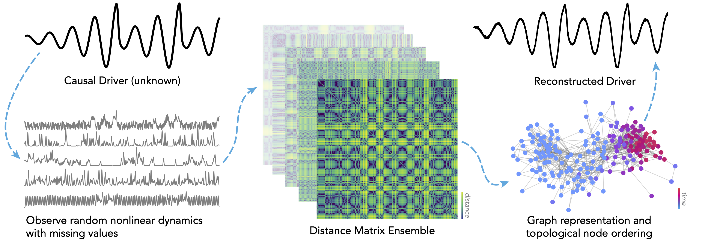

## shrec

The **sh**ared **rec**urrence method for identifying causal drivers of collections of time series 



## Usage

```python
from shrec.models import RecurrenceManifold
from benchmarks.dynamical_systems import load_data

X, y_true = load_data() # shape (n_timepoints, n_series)
model = RecurrenceManifold()
y_recon = model.fit_predict(X)
```

Additional examples can be found in the [`demos.ipynb`](demos.ipynb) notebook.

## Installation

Install the latest development version directly from GitHub

	git clone https://github.com/williamgilpin/shrec
	cd shrec
	pip install -I . 

Alternatively, using pip

	pip install git+https://github.com/williamgilpin/shrec

Test that everything is working

    python -m unittest
    
## Additional information

Install core dependencies

	conda install numpy scipy matplotlib networkx h5py numba

<!-- Install scanpy using conda. If you are using bash, you may need to remove the quotes around networkx

	conda install -c conda-forge scikit-learn scanpy python-igraph leidenalg 
	pip3 install --upgrade-strategy only-if-needed graspologic 'networkx[default]' -->

Install optional dependencies

	conda install -c conda-forge jupyterlab
	conda install seaborn pandas 

Dependencies
+ scikit-learn
+ scipy
+ numpy
<!-- + python-igraph
+ leidenalg -->

Additional dependencies only necessary for discrete drivers
+ networkx (necessary for learning discrete drivers only)
+ graspologic (necessary for learning discrete drivers only)

Additional dependencies for certain demonstrations
+ matplotlib 
+ seaborn
+ pandas
+ h5py

## Development and Contributing

We welcome any suggestions or improvments. Please feel free to reach reach out, raise issues, or submit pull requests.


